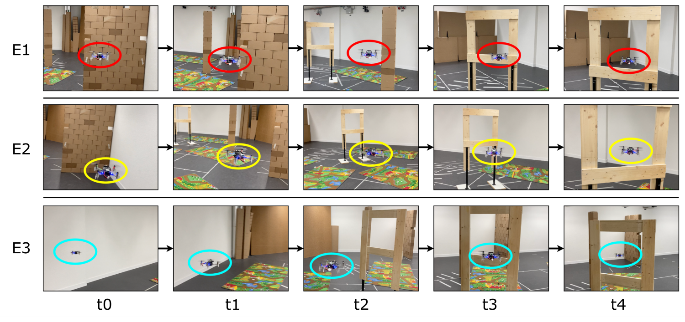

[![Contributors][contributors-shield]][contributors-url]
[![Forks][forks-shield]][forks-url]
[![Stargazers][stars-shield]][stars-url]
[![Issues][issues-shield]][issues-url]
[![License][license-shield]][license-url]

# Stargate: Multimodal Sensor Fusion for Autonomous Navigation on Miniaturized UAVs

## About the Project
Autonomously navigating robots need to perceive and interpret their surroundings. Currently, cameras are among the most used sensors due to their high resolution and frame rates at relatively low energy consumption and cost. In recent years, cutting-edge sensors, such as miniaturized depth cameras, have demonstrated strong potential, specifically for nano-size unmanned aerial vehicles (UAVs), where low power consumption, lightweight hardware, and low computational demand are essential. However, cameras are limited to working under good lighting conditions, while depth cameras have a limited range. To maximize robustness, we propose to fuse a millimeter form factor 64 pixel depth sensor and a low-resolution grayscale camera. In this work, a nano-UAV learns to detect and fly through a gate with a lightweight autonomous navigation system based on two tinyML convolutional neural network models trained in simulation, running entirely onboard in 7.6 ms and with an accuracy above 91%. Field tests are based on the Crazyflie 2.1, featuring a total mass of 39 g. We demonstrate the robustness and potential of our navigation policy in multiple application scenarios, with a failure probability down to 1.2 · 10-3 crash/meter, experiencing only two crashes on a cumulative flight distance of 1.7 km.

## Demonstration Video
The following video showcases **Stargate** operating onboard a 44 g nano-drone. [**YouTube link**](https://youtu.be/B4_TtdQd32E).

## Publications
If you use **Stargate** in an academic or industrial context, please cite the following publications:

Publications: 
* *Stargate: Multimodal Sensor Fusion for Autonomous Navigation on Miniaturized UAVs* [IEEE IoT Journal]([https://ieeexplore.ieee.org/](https://ieeexplore.ieee.org/document/10423569))

~~~~
@article{kalenberg2024stargate,
  title={Stargate: Multimodal Sensor Fusion for Autonomous Navigation On Miniaturized UAVs},
  author={Kalenberg, Konstantin and M{\"u}ller, Hanna and Polonelli, Tommaso and Schiaffino, Alberto and Niculescu, Vlad and Cioflan, Cristian and Magno, Michele and Benini, Luca},
  journal={IEEE Internet of Things Journal},
  year={2024},
  publisher={IEEE}
}
~~~~

~~~~
@article{muller2023robust,
  title={Robust and efficient depth-based obstacle avoidance for autonomous miniaturized uavs},
  author={M{\"u}ller, Hanna and Niculescu, Vlad and Polonelli, Tommaso and Magno, Michele and Benini, Luca},
  journal={IEEE Transactions on Robotics},
  year={2023},
  publisher={IEEE}
}
~~~~

## Getting Started
https://github.com/ETH-PBL/Matrix_ToF_Drones

## Open-source dataset

Please refer to the README in the folder `dataset` for more information on our [open-source dataset](https://zenodo.org/records/10546408).

## Synthetic data generation

Please refer to the README in the folder `automated_data_collection` for more information on generating your own synthetic data.

## Building and executing the project

### 1-Cloning this repo
`git clone <<the url of this repository>>` \
`cd Stargate`

### 2-Setting up environment and Python libraries

The project has been tested using Ubuntu 20.04 and a conda environment featuring Python 3.9.18. 
It can be set by using the following commands: \
`conda create --name Stargate python=3.9` \
`conda activate Stargate` \
`pip3 install -r requirements.txt` 

### 3-Installing necessary tools and libraries
Exit the git repo and perform these steps: 

Install the toolchain and the SDK of GAP8, by looking at the README file of the [gap_sdk repo](https://github.com/GreenWaves-Technologies/gap_sdk/tree/e431b7f1ca687d10ad08c3def01a754583fec5da). 

Please keep in mind that we used an older version of the SDK, therefore please use the following commands during the installation to clone the correct commit: \
`git clone https://github.com/GreenWaves-Technologies/gap_sdk.git` \
`cd gap_sdk` \
`git reset --hard e431b7f1ca687d10ad08c3def01a754583fec5da`

Source the sourceme.h in the main directory of the gap_sdk and select 2-GAPOC_B_V2: \
`source sourceme.sh`

Note that the older version is not compatible with Ubuntu 22.04 (only with 20.04). To build the SDK on a Ubuntu 22.04 machine you need to apply two workarounds: replace `pthread_yield();` on line 313 in `dpi_wrapper_impl.cpp` by `sched_yield();` and build the SDK with `CFLAGS="-Wno-stringop-overflow -Wno-misleading-indentation"`. Another possible workaround is to use the newest SDK - however, this is not tested.  \

### 4-Downloading the dataset
Now come back to this git repository.

If you want to train on a small sub-set of the dataset, you can skip this section since the git repository already contains a small part of the dataset in the [dataset](dataset) folder. 

Download and un-zip the dataset. \
Modify the DATA_PATHS in the [training_quantizaton/deep_learning_config.ini](training_quantizaton/deep_learning_config.ini) file so that it points to the directories in which you have downloaded the dataset.

### 5-Training & Quantization of the CNN Models

Please, refer to the specific [README](training_quantization/README.md) to gain more insights on the execution. 

From the main folder of this repository execute the following commands:

`cd training_quantization/` \
`python3 main_deep_learning.py` 

The models will be saved in the following directories: \
"training_quantization/onnx_models", "training_quantization/tflite_models"

Quantization's zero points and scale values of inputs and output are saved in the "training_quantization/deep_learning_config.ini" file.

### 6-C-code generation for deployment

Please, refer to the specific [README](deployment/README.md) to gain more insights on the execution.

From the main folder of the repository execute the following commands:

`cd deployment/` \
`python3 main_deployment.py` 

The deployed models generated will be saved in the following directories: \
"deployment/classification_model_quant", "deployment/classification_model_quant" 

### 6-Flashing and starting the drone
Please refer to the specific [README](drone_code/README.md) for more information on flashing and starting the drone.

<!-- MARKDOWN LINKS & IMAGES -->
<!-- https://www.markdownguide.org/basic-syntax/#reference-style-links -->

[contributors-shield]: https://img.shields.io/github/contributors/ETH-PBL/Stargate.svg?style=flat-square
[contributors-url]: https://github.com/ETH-PBL/Stargate/graphs/contributors
[forks-shield]: https://img.shields.io/github/forks/ETH-PBL/Stargate.svg?style=flat-square
[forks-url]: https://github.com/ETH-PBL/Stargate/network/members
[stars-shield]: https://img.shields.io/github/stars/ETH-PBL/Stargate.svg?style=flat-square
[stars-url]: https://github.com/ETH-PBL/Stargate/stargazers
[issues-shield]: https://img.shields.io/github/issues/ETH-PBL/Stargate.svg?style=flat-square
[issues-url]: https://github.com/ETH-PBL/Stargate/issues
[license-shield]: https://img.shields.io/github/license/ETH-PBL/Stargate.svg?style=flat-square
[license-url]: https://github.com/ETH-PBL/Stargate/blob/master/LICENSE
[product-screenshot]: pics/drone.png

## License

Unless explicitly stated otherwise, the code is released under GPL-3.0, see the LICENSE file in the root of this repository for details.
As an exception, the data under the directory `./dataset` is released under Creative Commons Attribution-NoDerivatives 4.0 International, see `./dataset/LICENSE` for details.
