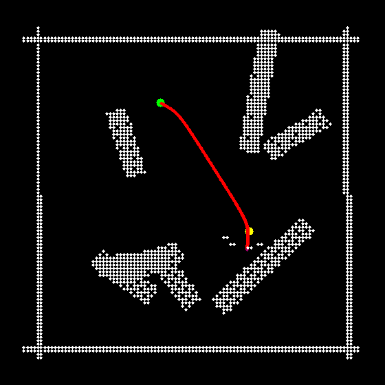

# Dataset
The provided [open-source dataset](https://zenodo.org/records/10546408) consists of 40'000 datapoints for the classification task and 70'000 datapoints for the navigation task. The datapoints are collected over randomized runs in a changing environment according to the following structure.
* classification task training: 320 simulated runs
* classification task validation: 80 simulated runs
* navigation task training: 640 simulated runs
* navigation task validation: 160 simulated runs

Each run (indicated by an integer numbered folder name) contains the following sensor type folders:
* angular_velocities
* camera_images
* label_forward_velocity_desired
* label_yaw_rate_desired
* linear_accelerations
* linear_velocities
* roll_pitch_yaw
* tof_distance_array
* tof_validity_array
  
**Carefull**, several runs with the same integer numbering might exist in different folders (e.g. training and validation). Those are not the same run, but just the run numbering for each folder starting at index 0.

Each recorded sensor type folder contains a variable number of datapoints per run (since the flight length was variable per run), of course with the same number of different sensor datapoints in a single run. The correspondences between the different sensor type datapoints are established through an integer numbering of the `.npy` files. E.g. (angular_velocities/20.npy corresponds to camera_images/20.npy, tof_distance_arrray/20.npy and so on.). **Carefull**, the numbering of the single datapoint might not be continous due to random thinning out of datapoints as described in the report.

Additionaly, each run folder contains an `setup_image.png` showing a 2D map of the randomized world used in this run

## Classification
The labels for the classification task are implicitly given by the folder structure of the dataset. Both the classification training and validation folders contain subfolders named gate (scene contains a gate) and no_gate (scene contains no gate). The structure for each run is again identical to the description above

